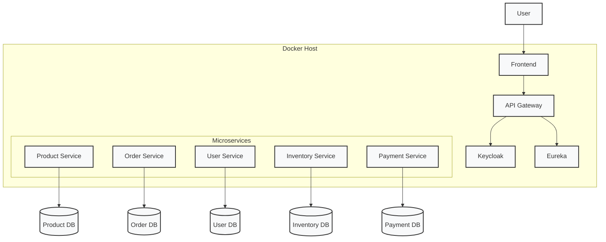

# Microservice Architecture

## Component Legend

| Component         | Description                                                                 |
|-------------------|-----------------------------------------------------------------------------|
| User              | End-user interacting with the system                                       |
| Frontend          | Web interface (React/Angular/Vue)                                          |
| API Gateway       | Entry point for all requests (Spring Cloud Gateway)                        |
| Keycloak          | Authentication and authorization server                                    |
| Eureka            | Service discovery server                                                   |
| Product Service   | Manages product catalog and inventory                                      |
| Order Service     | Handles order processing and tracking                                      |
| User Service      | Manages user profiles and authentication                                   |
| Inventory Service | Tracks stock levels and availability                                       |
| Payment Service   | Processes financial transactions                                           |
| *DB               | Dedicated database for each service (shown with entity name)               |
