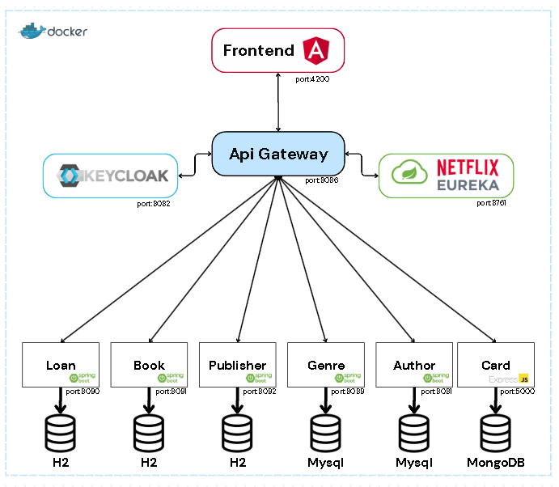
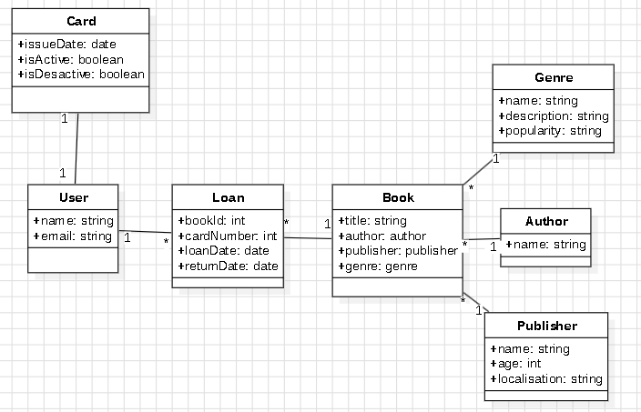
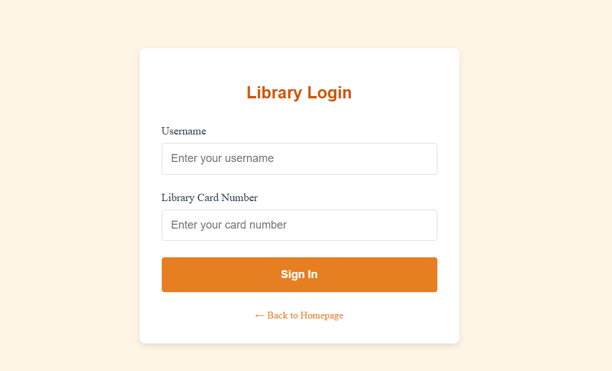
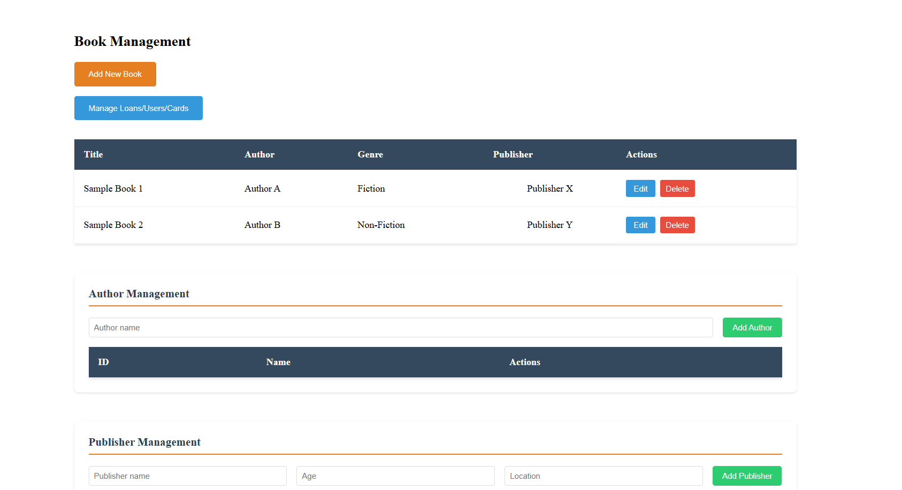
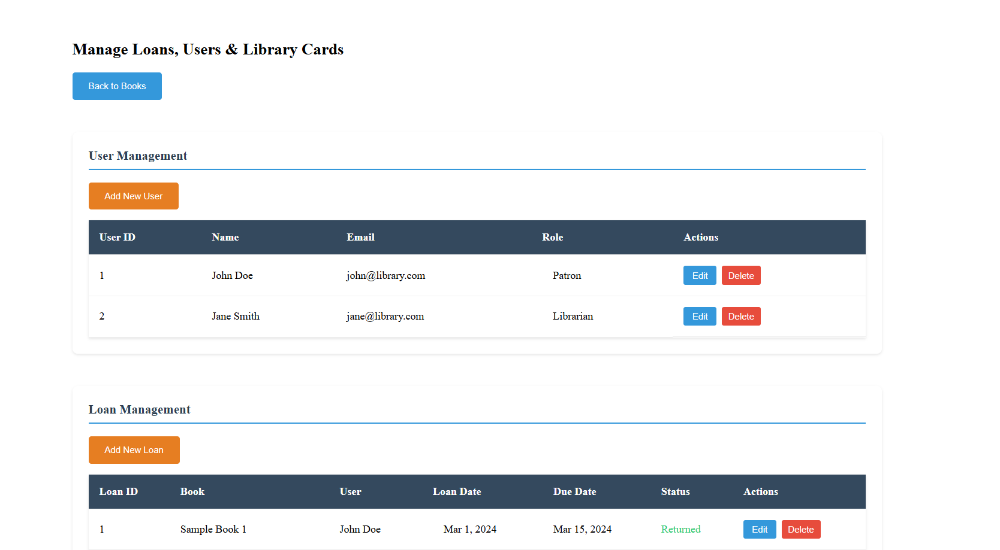

# Library Management System

The **Library Management System** is a simple yet powerful application that allows users to manage a collection of books. It provides functionalities to add, update, delete, and view books and some advanced functionalities making it ideal for libraries, personal collections, or educational institutions.

## Navigation
### Architecture
- [Ecosystem](#Ecosystem)
- [Class Diagram](#ClassDiagram)
- [Technology](#Technology)
### Frontend
- [Client](#Client)
  - Login
  - Homepage
- [Admin](#Admin)
  - User management
  - Book management
### Backend
- [Loan](#Loan)
- [Book](#Book)
- [Publisher](#Publisher)
- [Genre](#Genre)
- [Author](#Author)
- [Card](#Card)


# Architecture 
<a name="Ecosystem"></a>
1.Containerized Library Management System with Spring Cloud Ecosystem



<a name="ClassDiagram"></a>
2.Library Domain Model Class Diagram



<a name="Technology"></a>
3.Technology
## System Architecture Overview

| Architecture Layer       | Components                                                                 | Description                                                    |
|--------------------------|----------------------------------------------------------------------------|----------------------------------------------------------------|
| **Containerization**     | Docker                                                                     | Container orchestration for service deployment                 |
| **API Gateway**          | Netflix Zuul                                                               | Routing and API request filtering                              |
| **Service Discovery**    | Eureka Server                                                              | Service registry for microservice coordination                 |
| **Authentication**       | Keycloak                                                                   | Identity and Access Management (IAM) solution                  |
| **Frontend**             | Angular                                                                    | Web interface                                                  |
| **Microservices**        | Loan, Book, Publisher, Genre, Author, Card                                 | Domain-specific services                                       |
| **Databases**            | H2, MySQL, MongoDB                                                         | Polyglot persistence strategy                                  |
| **OpenFeign**            | Spring OpenFeign                                                           | Declarative REST client for service-to-service communication   |
| **Configuration Server** | Spring Config Server                                                       | Centralized configuration management                           |
| **Messaging**            | RabbitMQ                                                                   | Message broker for asynchronous communication                  | 
### Port Mapping
- API Gateway : 8086
- Eureka Server : 8761
- Keycloak : 8082
- RabbitMQ : 5672
- Microservices : Loan(8090) , Book(8091) , Publisher(8092) , Genre(8089) , Author(8081) , Card(5000)
- Databases : Mysql:3306 , MongoDB:27017
- Configuration Server : 8888
- Frontend : 4200


# Frontend

<a name="Client"></a>
## Client

1.Login (/login) :

The library login interface provides secure patron authentication through combined username and physical card number validation.



2.Homepage (/) :

 The library homepage serves as a patron's central portal, offering:
- Dynamic book catalog browsing with filter/sort capabilities
- Visual timeline of current/past loans


<a name="Admin"></a>
## Admin

1.User management (/admin/loans-users) :

 Central interface for managing library patrons, allowing administrators to:
- Create and manage user accounts
- Issue and link library cards to users
- Monitor and modify active loans (extend deadlines, resolve issues)



2.Book management (/admin/books) :

- Central interface for managing library catalog data, enabling administrators to:
- Create/Edit Books: Add new titles, update metadata, manage inventory
- Manage Authors & Publishers: Maintain creator/organization databases
- Organize Genres: Define and categorize literary genres




# Backend

<a name="Loan"></a>
## Loan
Loan management microservice with smart validation and automatic adjustment of return dates based on holidays.
### Technologies
- Java 17
- Spring Boot 3.x
- Spring Data JPA
- H2 Database 
### Functionalities
- Complete CRUD for loans
- Loan validation (limit of active loans per user)
- Multi-criteria loan filtering
- Automatic adjustment of return dates based on holidays
- Integration with the public holiday API
### API Reference
#### Get all loans

```http
  GET /loan
```
| Parameter   | Type      | Description                                                         |
| :---------- | :-------- | :------------------------------------------------------------------ |
| `loanId`    | `Integer` | **Required**. Identifiant unique du prêt.                           |
| `bookId`    | `Integer` | **Required**. Identifiant du livre concerné par le prêt.             |
| `cardNumber`| `String`  | **Required**. Numéro de carte de l'emprunteur.                       |
| `loanDate`  | `Date`    | **Required**. Date à laquelle le prêt a été initié.                  |
| `returnDate`| `Date`    | **Required**. Date prévue pour le retour du livre.                   |


#### Get loan by id

```http
GET /loan/{loanId}
```

| Parameter | Type     | Description                       |
| :-------- | :------- | :-------------------------------- |
| `id`      | `integer` | **Required**. Id of loan to fetch |

#### Update loan by id

```http
  PUT /loan/{loanId}
```

| Parameter | Type     | Description                       |
| :-------- | :------- | :-------------------------------- |
| `id`      | `integer` | **Required**. Id of loan to fetch |


#### Delete loan by id

```http
 DELETE /loan/{loanId}
```

| Parameter | Type     | Description                       |
| :-------- | :------- | :-------------------------------- |
| `id`      | `integer` | **Required**. Id of loan to fetch |


#### Add a new loan

```http
  POST /loan
```

#### Get loans by filters

```http
  GET  /loan/filter (http://localhost:8086/loan/filter?bookId=4)
```


#### Get loan statistics

```http
 GET /loan/statistics
```


#### Get Adjust return date for holiday

```http
  GET /loan/{loanId}/adjust-return-date(http://localhost:8090/loan/11/adjust-return-date?countryCode=TN)
```
<a name="Book"></a>
## Book
Centralized book management service with author/publisher linking and dynamic inventory status updates.
### Technologies
- Java 17
- Spring Boot 3.x
- Spring Data JPA
- H2 Database 
### Functionalities
- Complete CRUD for books
- check book status
### API Reference
#### Get all books

```http
  GET /books
```

| Parameter | Type     | Description                       |
| :-------- | :------- | :-------------------------------- |
| `title`      | `string` | **Not Required**. title of book to fetch |
| `author`      | `integer` | **Not Required**. authorId of book to fetch |
| `publisher`      | `integer` | **Not Required**. publisherId of book to fetch |
| `genre`      | `integer` | **Not Required**. genreId of book to fetch |

#### Get book by id

```http
  GET /books/${id}
```

| Parameter | Type     | Description                       |
| :-------- | :------- | :-------------------------------- |
| `id`      | `string` | **Required**. Id of BOOK to fetch |

#### Update book by id

```http
  PUT /books/${id}
```

| Parameter | Type     | Description                       |
| :-------- | :------- | :-------------------------------- |
| `id`      | `string` | **Required**. Id of BOOK to fetch |


#### Delete book by id

```http
  DELETE /books/${id}
```

| Parameter | Type     | Description                       |
| :-------- | :------- | :-------------------------------- |
| `id`      | `string` | **Required**. Id of BOOK to fetch |


#### Add a new book

```http
  POST /books
```

#### Get books By authors

```http
  GET /books/getBooksByAuthors
```


#### Get books cout by  publisher

```http
  GET /books/getBooksCountByPublisher
```


#### Get books distribution by  status

```http
  GET /books/getBooksCountByStatus
```

<a name="Publisher"></a>
## Publisher
Centralized publisher management service with geolocation capabilities and demographic analytics.
### Technologies
- Java 17
- Spring Boot 3.x
- Spring Data JPA
- H2 Database 

### Functionalities
- Complete CRUD operations for publishers
- Multi-criteria search
- Demographic statistics
- Geolocated search
- Data export
- External service integration

### API Reference

### Gestion des éditeurs

| Méthode | Endpoint                | Description                          |
|---------|-------------------------|--------------------------------------|
| GET     | `/publishers/all`       | Liste tous les éditeurs              |
| GET     | `/publishers/getPub/{id}`| Récupère un éditeur par ID           |
| POST    | `/publishers`           | Crée un nouvel éditeur               |
| PUT     | `/publishers/update/{id}`| Met à jour un éditeur                |
| DELETE  | `/publishers/delete/{id}`| Supprime un éditeur                  |

### Recherche

| Méthode | Endpoint                | Description                          |
|---------|-------------------------|--------------------------------------|
| GET     | `/publishers/search`    | Recherche par nom ou localisation    |
| GET     | `/publishers/nearby`    | Recherche géolocalisée               |

### Export

| Méthode | Endpoint              | Description                          |
|---------|-----------------------|--------------------------------------|
| GET     | `/publishers/export`  | Export les publishers en un ficher csv |

### Statistiques

| Méthode | Endpoint                | Description                          |
|---------|-------------------------|--------------------------------------|
| GET     | `/publishers/stats-demographic` | Statistiques démographiques  |

<a name="Genre"></a>
## Genre
Centralized genre management service with popularity tracking and categorization features.
### Technologies
- Java 17
- Spring Boot 3.x
- Spring Data JPA
- H2 Database 
### Functionalities
- Complete CRUD operations for genres
- Popularity score tracking
- Top genres analytics

### API Reference
#### Get all Genres
```http
  GET /Genre/
```
| Parameter          | Type       | Description                        |
| :------------------| :-------   | :----------------------------------|
| `name`             | `string`   | **Required**. name of genre        |
| `description`      | `string`   | **Required**. description of genre |
| `popularity`       |  `integer` | **Required**. popularity of genre  |
#### Get genre by id
```http
  GET /Genre/${id}
```
| Parameter | Type     | Description                        |
| :-------- | :------- | :--------------------------------  |
| `id`      | `string` | **Required**. Id of genre to fetch |

#### Update genre by id
```http
  PUT /Genre/
```
| Parameter | Type       | Description                       |
| :-------- | :-------   | :-------------------------------- |
| `Genre`   | `genre`    | **Required**. updated genre       |


#### Delete book by id
```http
  DELETE /Genre/${id}
```
| Parameter | Type     | Description                       |
| :-------- | :------- | :-------------------------------- |
| `id`      | `string` | **Required**. Id of genre to fetch |


#### Add a new book
```http
  POST /Genre/
```
#### Get Top 5 genres
```http
  GET /Genre/Top5
```

<a name="Author"></a>
## Author
Authors management microservice with full CRUD and pagination system.
### Technologies
- Java 17
- Spring Boot 3.x
- Spring Data JPA
- H2 Database 
## Functionalities
- Complete CRUD for authors
- Advanced pagination system
- Multi-criteria search
- Filtering by literary genre
### API Endpoints

#### Gestion des auteurs
| Méthode | Endpoint               | Description                     |
|---------|------------------------|---------------------------------|
| GET     | `/author/all-list`     | Liste tous les auteurs          |
| GET     | `/author/{id}`         | Récupère un auteur par ID       |
| POST    | `/author`              | Crée un nouvel auteur           |
| PUT     | `/author/update/{id}`  | Met à jour un auteur            |
| DELETE  | `/author/delete/{id}`  | Supprime un auteur              |

#### Recherche et pagination
| Méthode | Endpoint               | Description                     |
|---------|------------------------|---------------------------------|
| GET     | `/author/search`       | Recherche paginée (nom/email)   |
| GET     | `/author/all`          | Filtre paginé par genre         |

#### Paramètres de pagination
| Paramètre  | Description                          | Valeur par défaut |
|------------|--------------------------------------|-------------------|
| `page`     | Numéro de page (0-based)             | 0                 |
| `size`     | Nombre d'éléments par page           | 10                |
| `sort`     | Champ de tri (ex: name,asc)          | id                |

<a name="Card"></a>
## Card
Secure library card management system with status tracking and access control features.
### Technologies
- Node.js
- Express.js
- Keycloak Authentication
- Joi Validation Middleware
### Functionalities
- Card lifecycle management (create/update/delete)
- Card status activation/deactivation
- Access statistics tracking
- Secure authentication integration

### API Reference

#### Get card by ID
```http
GET /api/cards/${id}
```
**Parameters**  
| Parameter | Type   | Description       |
|-----------|--------|-------------------|
| id        | string | Required. Card ID |

---
#### Create new card
```http
POST /api/cards
```
**Body Parameters**  
| Parameter | Type   | Description                                        |
|-----------|--------|----------------------------------------------------|
| cardData  | object | Required. Card details following schema validation |

---
#### Update card
```http
PUT /api/cards/${id}
```
**Parameters**  
| Parameter | Type   | Description       |
|-----------|--------|-------------------|
| id        | string | Required. Card ID |

---

#### Delete card
```http
DELETE /api/cards/${id}
```
**Parameters**  
| Parameter | Type   | Description       |
|-----------|--------|-------------------|
| id        | string | Required. Card ID |

---
#### Get card statistics
```http
GET /api/cards/stats
```
---
#### Toggle card status
```http
PUT /api/cards/${id}/status
```
**Parameters**  
| Parameter | Type   | Description       |
|-----------|--------|-------------------|
| id        | string | Required. Card ID |


